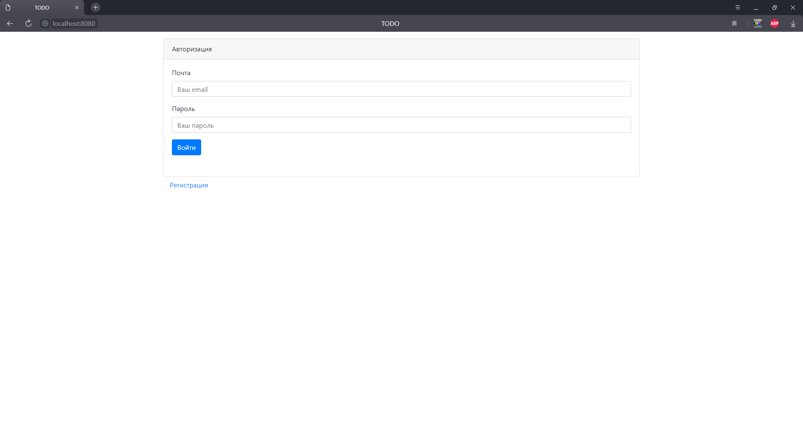

# job4j_todo

Веб-приложение представляет собой todo-list запланированных дел. Можно скрывать или показывать выполненные дела, 
назначать категорию важности. Присутствует авторизация и разделение дел по пользователям.

Технологии: 
- Hibernate
- Servlets
- Ajax, HTML
- Java
- Tomcat

